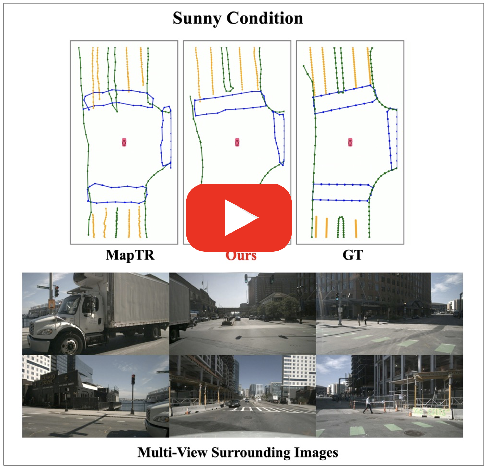
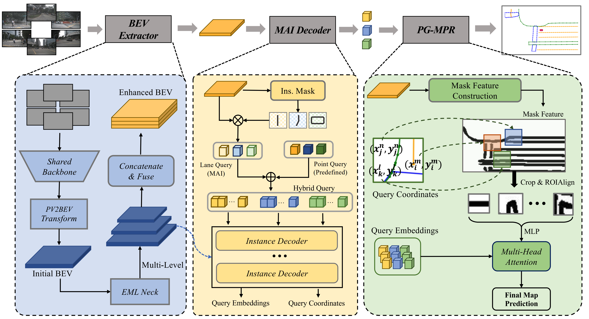

# MGMap: Mask-Guided Learning for Online Vectorized HD Map Construction

> Xiaolu Liu, Song Wang, Wentong Li, Ruizi Yang, Junbo Chen, Jianke Zhu
>
> **[[Paper]](https://arxiv.org/pdf/2404.00876.pdf) (arXiv). CVPR2024**

## Video Demo

<p align="center"> <a href="https://youtu.be/woTOaVPmHYQ"></a> </p>


## Introduction

We propose MGMap, a mask-guided approach that effectively highlights the informative regions and achieves precise map element localization by introducing the learned masks. Specifically, MGMap employs learned masks based on the enhanced multi-scale BEV features from two perspectives. At the instance level, we propose the Mask-activated instance (MAI) decoder, which incorporates global instance and structural information into instance queries by the activation of instance masks. At the point level, a novel position-guided mask patch refinement (PG-MPR) module is designed to refine point locations from a finer-grained perspective, enabling the extraction of point-specific patch information. Compared to the baselines, our proposed MGMap achieves a notable promotion of around 10 mAP for different input modalities. Extensive experiments also demonstrate that our approach showcases strong robustness and generalization capabilities. 



## TODO

- [ ] Release the code. (As soon as possible)

- [ ] Add configs for LiDAR and fusion modalities.

- [ ] Release pre-trained models.

## Getting Started

- [Installation](./docs/install.md)
- [Prepare Dataset](./docs/prepare_dataset.md)
- [Train and Eval](./docs/train_eval.md)


## Quantitative Results

### nuScenes dataset

| Model |   Modality   | Backbone | Epoch | mAP  | FPS  |                   Config                    |                 Download                   |
| :---: | :----------: | :------: | :---: | :--: | :--: | :-----------------------------------------: | :----------------------------------------: |
| MGMap |    Camera    |   R50    |  30   | 61.4 | 11.6 | [config](https://github.com/xiaolul2/MGMap) | [model](https://github.com/xiaolul2/MGMap) |
| MGMap |    Lidar     |  Second  |  24   | 67.9 | 5.5  | [config](https://github.com/xiaolul2/MGMap) | [model](https://github.com/xiaolul2/MGMap) |
| MGMap | Camera&Lidar | R50&Sec  |  24   | 71.7 | 4.8  | [config](https://github.com/xiaolul2/MGMap) | [model](https://github.com/xiaolul2/MGMap) |


## Acknowledgements

MGMap is based on [mmdetection3d](https://github.com/open-mmlab/mmdetection3d). It is also greatly inspired by the following outstanding contributions to the open-source community: [BEVFormer](https://github.com/fundamentalvision/BEVFormer), [HDMapNet](https://github.com/Tsinghua-MARS-Lab/HDMapNet), [MapTR](https://github.com/hustvl/MapTR), [SparseInst](https://github.com/hustvl/SparseInst).

## Citation

If the paper and code help your research, please kindly cite:

```BibTeX
@misc{liu2024mgmap,
      title={MGMap: Mask-Guided Learning for Online Vectorized HD Map Construction}, 
      author={Xiaolu Liu and Song Wang and Wentong Li and Ruizi Yang and Junbo Chen and Jianke Zhu},
      year={2024},
      eprint={2404.00876},
      archivePrefix={arXiv},
      primaryClass={cs.CV}
}
```

​    

